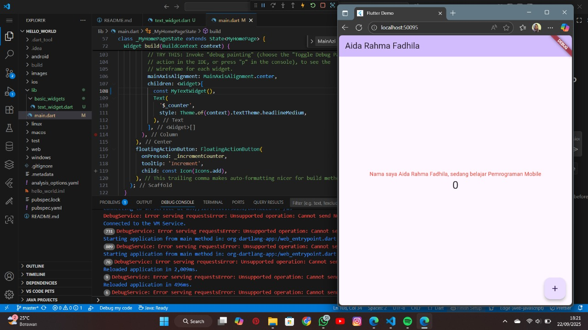
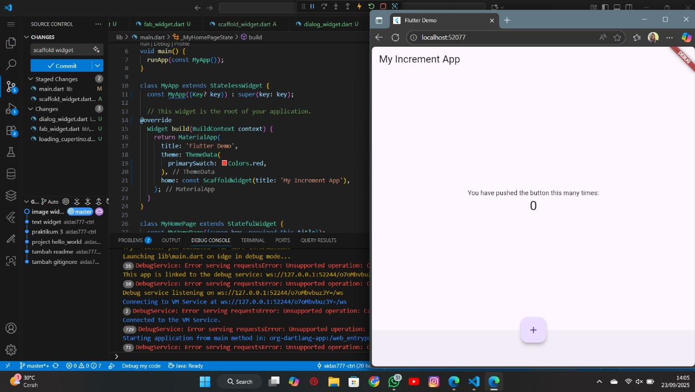
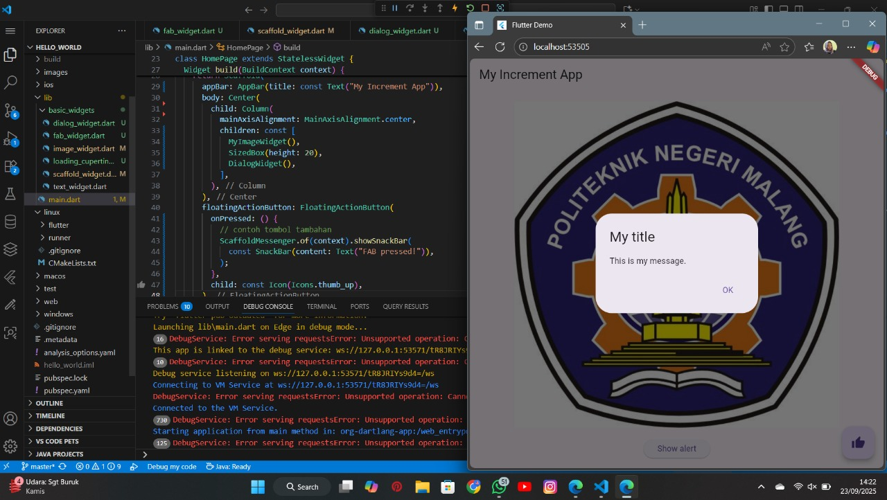
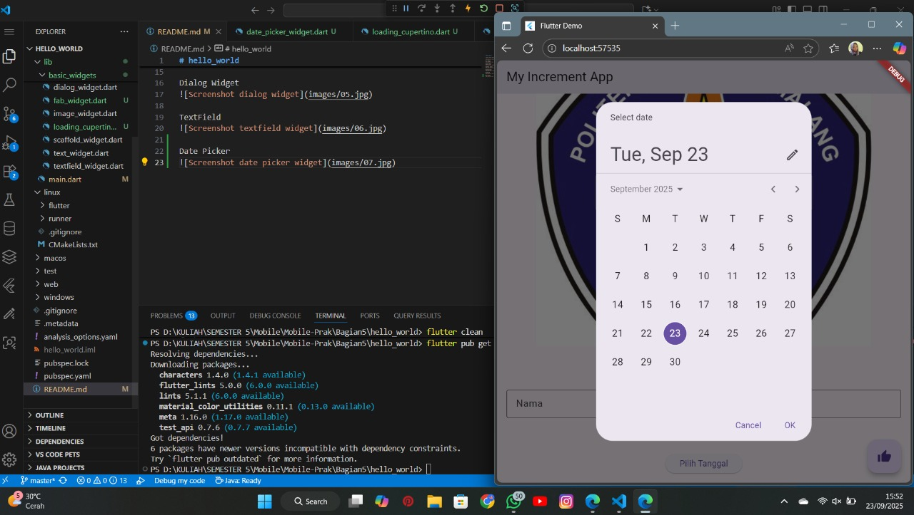

# hello_world

A new Flutter project.

Praktikum 1 — Membuat Project Flutter Baru

Tujuan: Membuat project Flutter baru (dengan contoh: hello_world) menggunakan Command Palette VS Code atau CLI.

Praktikum 2 — Menghubungkan Perangkat Android / Emulator

Tujuan: Menghubungkan aplikasi ke perangkat fisik Android melalui USB debugging atau menjalankan di emulator.

Praktikum 3 — Membuat Repository GitHub

Tujuan: Menyimpan project ke repository GitHub.

Praktikum 4 — Text Widget & Image Widget

Tujuan: Memahami penggunaan Text dan Image di Flutter.

Text Widget: 
- Text('Hello') untuk menampilkan teks.
- Gunakan properti seperti style, textAlign, overflow, dan maxLines untuk pengaturan tampilan.

Text Widget

Image Widget:
- Image.asset('images/logo.png') untuk gambar bundel (assets).
- Image.network(url) untuk menampilkan gambar dari internet.
- Jangan lupa menambahkan assets di pubspec.yaml:

Image Widget

Praktikum 5 — Cupertino Button, Loading, Scaffold, Dialog, TextField, DatePicker

Tujuan: Memperkenalkan beberapa widget UI (termasuk gaya iOS dengan Cupertino) dan interaksinya.

1. Cupertino Button & Loading Bar
- CupertinoActivityIndicator: indikator loading bergaya iOS. Dapat ditempatkan di layout saat menunggu proses.

2. Scaffold Widget
- Scaffold adalah kerangka dasar aplikasi Material: menampung appBar, body, floatingActionButton, dll.
- Gunakan untuk menciptakan struktur layout yang konsisten.

3. Dialog Widget
- Untuk menampilkan pesan / konfirmasi, gunakan showDialog() dengan AlertDialog (Material) atau CupertinoAlertDialog (iOS style).

4. TextField
- TextField memberikan input teks dari pengguna.

5. Date Picker
- showDatePicker (Material) memunculkan dialog pilih tanggal.

6. Date picker Kalender

7. Tampilan Final
- Kombinasi widget di atas dirangkai sehingga membentuk tampilan akhir aplikasi dengan logo, tombol dialog, input teks, date picker, dan loading indicator.

8. Tampilan pada Mobile
- Contoh bagaimana aplikasi terlihat pada perangkat sebenarnya

